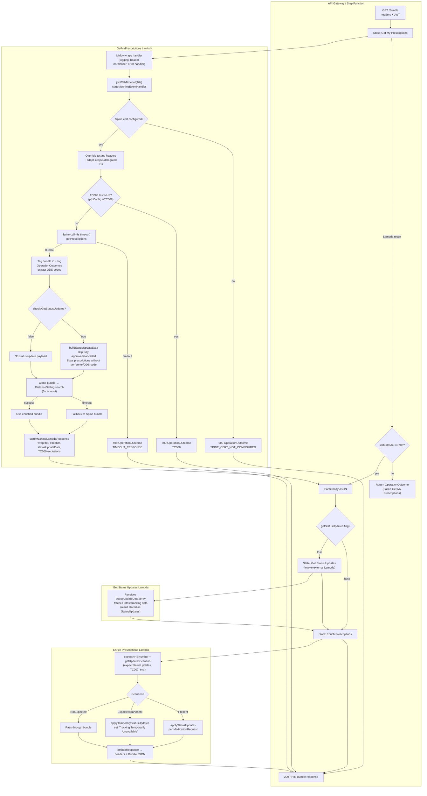

# Bundle endpoint behaviour

```mermaid
flowchart TB
    subgraph API["API Gateway / Step Function"]
        A[GET /Bundle<br>headers + JWT] --> S1["State: Get My Prescriptions"]
        S1 -->|Lambda result| S2{statusCode == 200?}
        S2 -- no --> F1["Return OperationOutcome<br>(Failed Get My Prescriptions)"]
        S2 -- yes --> P1[Parse body JSON]
        P1 --> T1{getStatusUpdates flag?}
        T1 -- false --> S3["State: Enrich Prescriptions"]
        T1 -- true --> S2a["State: Get Status Updates<br>(invoke external Lambda)"]
        S2a --> S3
        S3 --> R[200 FHIR Bundle response]
    end

    subgraph L1["GetMyPrescriptions Lambda"]
        S1 --> L10["Middy wraps handler<br>(logging, header normaliser, error handler)"]
        L10 --> L11["jobWithTimeout(10s)<br>stateMachineEventHandler"]
        L11 --> L12{Spine cert configured?}
        L12 -- no --> OC1[500 OperationOutcome<br>SPINE_CERT_NOT_CONFIGURED]
        L12 -- yes --> L13["Override testing headers<br>+ adapt subject/delegated IDs"]
        L13 --> L14{"TC008 test NHS?<br>(pfpConfig.isTC008)"}
        L14 -- yes --> OC2[500 OperationOutcome<br>TC008]
        L14 -- no --> L15["Spine call (9s timeout)<br>getPrescriptions"]
        L15 -->|timeout| OC3[408 OperationOutcome<br>TIMEOUT_RESPONSE]
        L15 -->|Bundle| L16["Tag bundle id + log<br>OperationOutcomes<br>extract ODS codes"]
        L16 --> L17{shouldGetStatusUpdates?}
        L17 -- true --> L18["buildStatusUpdateData<br>skip fully approved/cancelled<br>Skips prescriptions without performer/ODS code"]
        L17 -- false --> L19[No status update payload]
        L18 --> L20
        L19 --> L20["Clone bundle → DistanceSelling.search<br>(5s timeout)"]
        L20 -->|timeout| L21["Fallback to Spine bundle"]
        L20 -->|success| L22["Use enriched bundle"]
        L21 --> L23
        L22 --> L23["stateMachineLambdaResponse<br>wrap fhir, traceIDs,<br>statusUpdateData,<br>TC009 exclusions"]
    end

    subgraph L2["Get Status Updates Lambda"]
        S2a --> L30["Receives statusUpdateData array<br>fetches latest tracking data<br>(result stored as StatusUpdates)"]
    end

    subgraph L3["Enrich Prescriptions Lambda"]
        S3 --> L40["extractNHSNumber + getUpdatesScenario<br>(expectStatusUpdates, TC007, etc.)"]
        L40 --> L41{Scenario?}
        L41 -- Present --> L42["applyStatusUpdates<br>per MedicationRequest"]
        L41 -- ExpectedButAbsent --> L43["applyTemporaryStatusUpdates<br>set 'Tracking Temporarily Unavailable'"]
        L41 -- NotExpected --> L44[Pass-through bundle]
        L42 --> L45["lambdaResponse → headers + Bundle JSON"]
        L43 --> L45
        L44 --> L45
    end

    OC1 --> R
    OC2 --> R
    OC3 --> R
    L23 --> P1
    L30 --> S3
    L45 --> R
```
