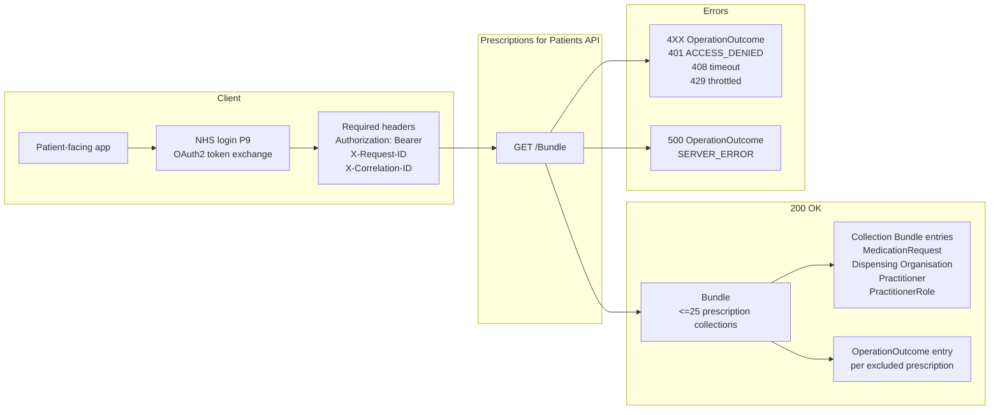

# Broad API path

```mermaid
flowchart LR
    subgraph Client
        U[Patient-facing app]
        A[NHS login P9<br>OAuth2 token exchange]
        H[Required headers<br>Authorization: Bearer<br>X-Request-ID<br>X-Correlation-ID]
    end

    subgraph API["Prescriptions for Patients API"]
        E[GET /Bundle]
    end

    subgraph Success["200 OK"]
        B[Bundle<br><=25 prescription collections]
        C[Collection Bundle entries<br>MedicationRequest<br>Dispensing Organisation<br>Practitioner<br>PractitionerRole]
        O[OperationOutcome entry<br>per excluded prescription]
    end

    subgraph Errors
        X[4XX OperationOutcome<br>401 ACCESS_DENIED<br>408 timeout<br>429 throttled]
        Y[500 OperationOutcome<br>SERVER_ERROR]
    end

    U --> A --> H --> E
    E --> B --> C
    B --> O
    E --> X
    E --> Y
```
